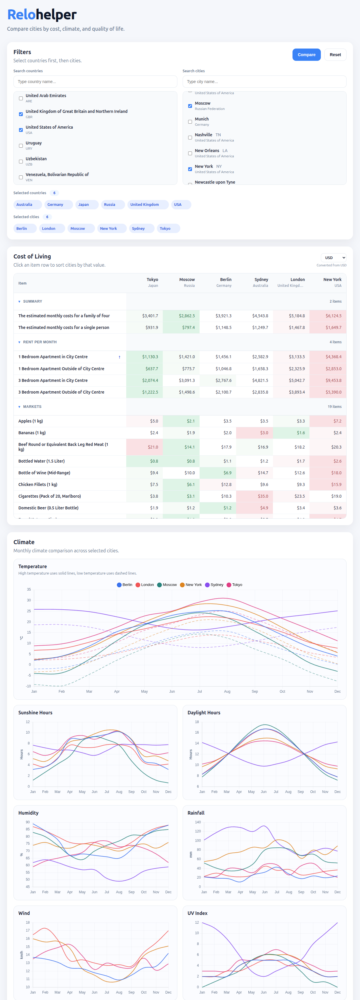
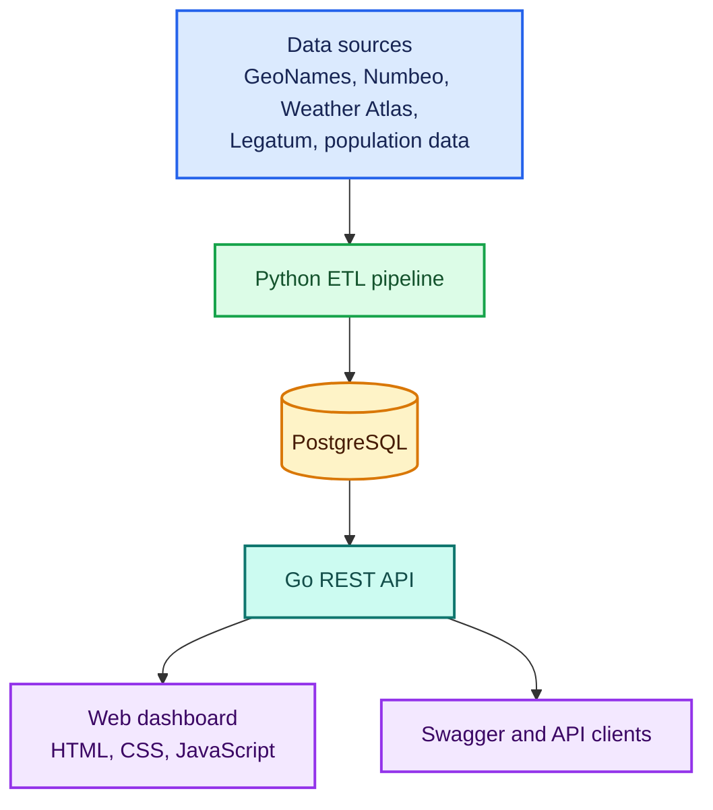
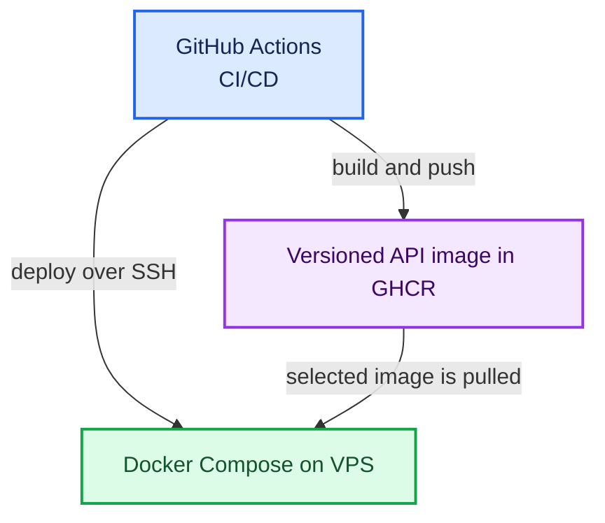
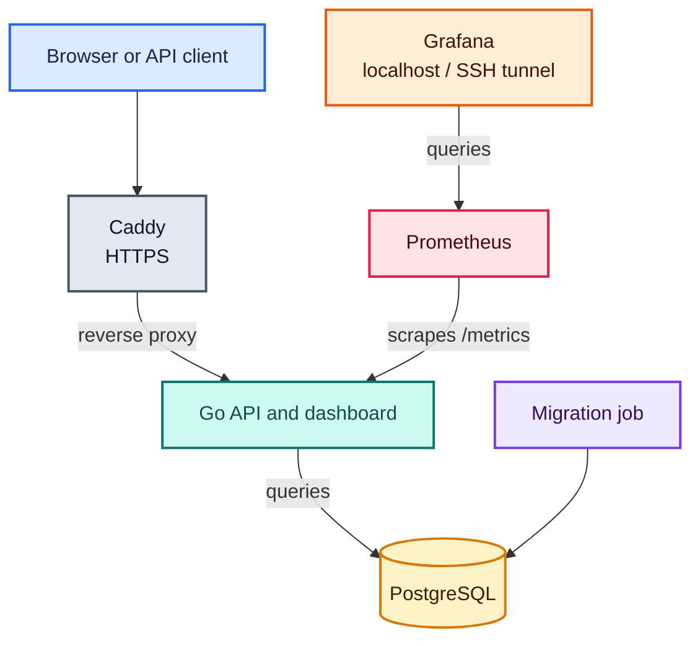
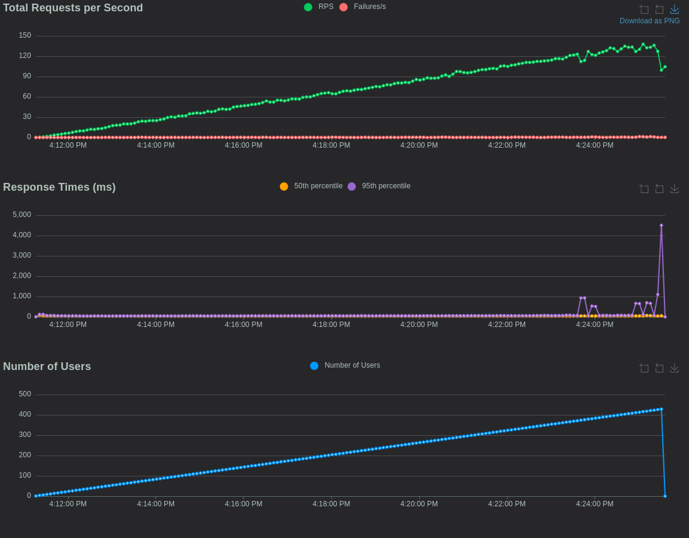
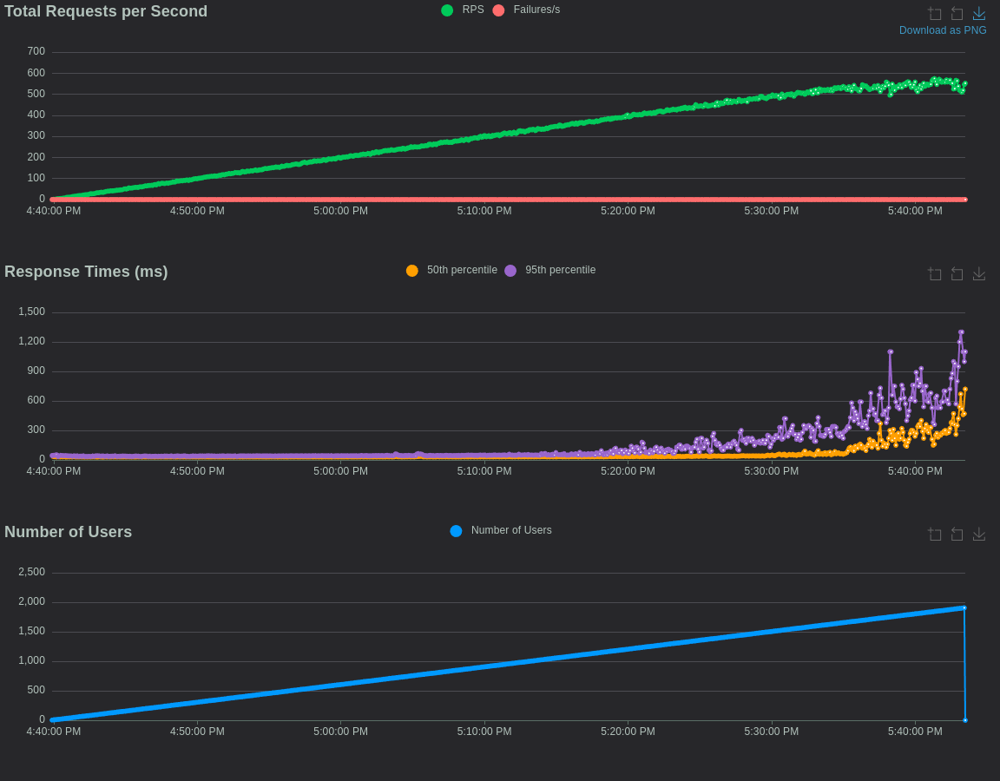
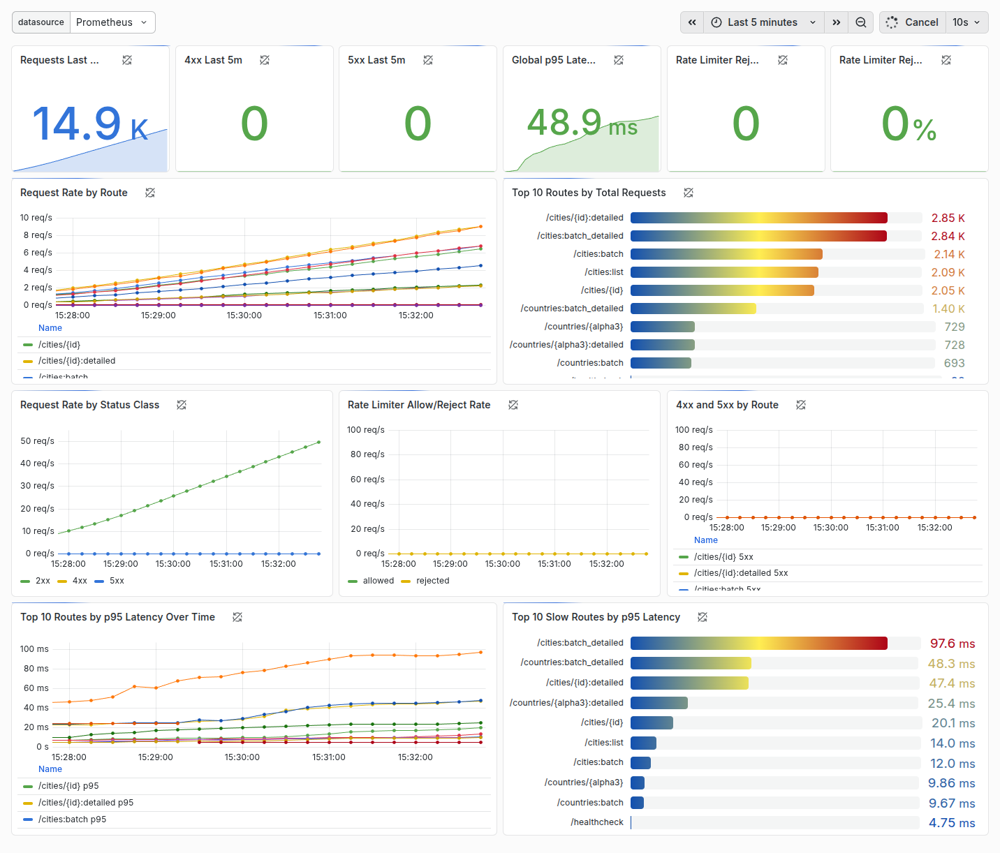
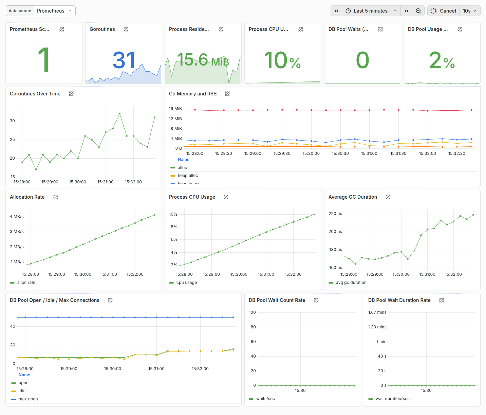

# Relohelper

[](https://github.com/denis-k2/relohelper-go/actions/workflows/ci.yml)

**API-first REST service with a built-in reference dashboard.**

Relohelper brings together cost of living, climate, quality of life, and
prosperity data for comparing cities and countries through a public Go API.

[Live dashboard](https://relohelper.pro/) |
[Swagger UI](https://relohelper.pro/swagger) |
[Releases](https://github.com/denis-k2/relohelper-go/releases) |
[Data pipeline](https://github.com/denis-k2/relohelper-data)

## What It Does

- Compares up to 20 cities in one view.
- Searches and filters cities and countries before building a comparison.
- Presents cost-of-living data in sortable tables with selectable currencies.
- Visualizes monthly temperature, sunshine, daylight, humidity, rainfall, wind,
  and UV index data.
- Compares city and country Numbeo indices and country-level Legatum Prosperity
  indicators.
- Exposes list, detail, and batch REST endpoints with optional related datasets.
- Serves the dashboard from the Go binary without a separate frontend build or
  deployment service.

<details>
  <summary>Full comparison view</summary>

  
</details>

## Architecture

The project is split into data acquisition and serving layers. The separate
[Python data pipeline](https://github.com/denis-k2/relohelper-data) collects and
normalizes source data, while this repository owns the API, dashboard,
observability, and production deployment.

### Data Flow



### Production Deployment

Image delivery:



Runtime traffic and observability:



Production runs as a Docker Compose stack with Caddy, a selected API image from
GHCR, PostgreSQL, Prometheus, and Grafana. Grafana is bound to localhost and
accessed through an SSH tunnel.

## Engineering Highlights

- **Typed PostgreSQL access:** SQL is the source of truth; `sqlc` generates the
  query API and `pgxpool` manages database connections.
- **Predictable query count:** detail endpoints use conditional SQL for requested
  includes, while batch endpoints use bulk queries whose count does not grow
  with the number of requested cities or countries.
- **Explicit API contract:** OpenAPI documentation is served through Swagger UI,
  with consistent validation and structured error responses.
- **Validated configuration:** runtime settings are loaded from
  `RELOHELPER_*` environment variables and checked before the server starts.
- **Reproducible delivery:** GitHub Actions validates changes, builds versioned
  API images on `main` and release tags, publishes them to GHCR, and supports
  manual deployment of a commit-specific `sha-*` or release image tag to the
  VPS.

## Performance

Relohelper began as a Python/FastAPI application and was later rewritten in Go.
A controlled Locust comparison of the early implementations showed:

- about **4x higher request throughput** for Go;
- **zero errors** in the Go run versus about **0.5%** for Python;
- a CPU-bound workload, with the Go run reaching the 100 Mbps network limit
  first.

These results compare
[`relohelper-go v0.1.0`](https://github.com/denis-k2/relohelper-go/releases/tag/v0.1.0)
with the corresponding asynchronous
[Python/FastAPI implementation](https://github.com/denis-k2/relohelper).
They do not represent a benchmark of every later optimization.

<details>
  <summary>Two-vCPU VPS benchmark charts</summary>

  **Python / FastAPI**

  

  **Go**

  
</details>

| SQL query path (20-city comparison) | Observed execution time |
| --- | ---: |
| `GetCitiesByIDs` | 3.6 ms |
| `GetNumbeoCostByCityIDs` | 41-54 ms |
| `GetNumbeoCityIndicesByCityIDs` | 0.8 ms |
| `GetAvgClimateByCityIDs`, before optimization | about 114 ms |
| `GetAvgClimateByCityIDs`, after optimization | about 7.3 ms |

The climate query improvement came from replacing dynamic JSON expansion and
repeated processing with explicit ordered aggregation in a single grouped pass.
The measurements are PostgreSQL execution times from `EXPLAIN (ANALYZE,
BUFFERS)`, not end-to-end HTTP latency.

[Go vs Python benchmark and Locust reports](docs/performance/runs/2025-04-22_compare-go-v0.1.0_py-v0.3.0/README.md) |
[SQL query analysis](docs/performance/runs/2026-06-18_city-comparison-query-analysis/README.md)

## Observability

Prometheus and provisioned Grafana dashboards cover HTTP traffic, latency,
errors, rate limiting, Go runtime behavior, and the PostgreSQL connection pool.
The screenshots below show the dashboards during a load test.



<details>
  <summary>Go runtime and PostgreSQL pool dashboard</summary>

  
</details>

## Technology Stack

| Area | Technologies |
| --- | --- |
| Backend | Go, chi, REST, OpenAPI / Swagger |
| Database | PostgreSQL, pgx, pgxpool, sqlc, golang-migrate |
| Data pipeline | Python, pandas, BeautifulSoup, requests, Jupyter |
| Dashboard | HTML, CSS, JavaScript, Chart.js |
| Testing | Go test, PostgreSQL integration tests, Locust |
| Delivery | Docker, Docker Compose, GitHub Actions, GHCR, Caddy |
| Observability | Prometheus, Grafana, structured logging |

## Project Evolution

The [original Relohelper](https://github.com/denis-k2/relohelper) was implemented
with Python and FastAPI. It established the data model, acquisition pipeline,
API contract, and load-testing baseline. The backend was subsequently rewritten
in Go and is now the primary maintained implementation.

Data collection has also been separated into
[`relohelper-data`](https://github.com/denis-k2/relohelper-data), keeping
external-source parsing independent from the public API lifecycle.

## Local Development

Requirements:

- Go version declared in [`go.mod`](go.mod)
- PostgreSQL 18
- `direnv` for loading the local `.envrc`
- development tools used by the Makefile (`sqlc`, `golang-migrate`,
  `golangci-lint`, and `modernize`)

The development and test PostgreSQL databases must already exist.
`make db/test/prepare` applies migrations and deterministic fixtures, but it
does not create or start a PostgreSQL server.

Create `.envrc` from the documented example and approve it:

```bash
cp .envrc.example .envrc
# Edit .envrc with local database credentials.
direnv allow
```

Apply development migrations, prepare the deterministic test database, and run
the full quality suite:

```bash
make db/migrations/up
make db/test/prepare
make audit
```

The test preparation target applies all migrations and replaces domain data
with the minimal fixture in `tests/fixtures`. As a safety check, it only runs
when the target database name contains `test`.

Start the API with authentication disabled:

```bash
make run/api
```

See [docs/configuration.md](docs/configuration.md) for all environment
variables, defaults, and local and production examples.

### Generated Database Code

SQL query sources live in `internal/db/queries/*.sql`; `sqlc` generates the Go
package in `internal/db`.

Generated files are committed but must not be edited manually:

```bash
make db/sqlc/generate
make db/sqlc/check
```

For code review, start with `internal/db/queries/*.sql` and the `internal/data`
mappers. The latter keep generated database rows separate from API/domain
models.

## Production Deployment

CI validates every pull request and every push to `main`. Pushes to `main` and
release tags also publish versioned images to
[`ghcr.io/denis-k2/relohelper-go`](https://github.com/denis-k2/relohelper-go/pkgs/container/relohelper-go).

Production deployment is started manually through GitHub Actions with either a
release image tag such as `0.6.0` or a commit-specific `sha-<commit>` image tag.
The workflow connects to the VPS over SSH, pulls the selected image, runs
migrations, recreates the Compose services, and verifies API readiness.

Deployment files:

- [`deploy/docker-compose.yml`](deploy/docker-compose.yml)
- [`deploy/Caddyfile`](deploy/Caddyfile)
- [`deploy/DEPLOY.md`](deploy/DEPLOY.md)
- [`.env.example`](.env.example)

## Documentation

- [`docs/performance`](docs/performance) - methodology, scenarios, benchmark
  runs, and SQL investigations
- [`docs/configuration.md`](docs/configuration.md) - runtime configuration
- [`deploy/DEPLOY.md`](deploy/DEPLOY.md) - VPS deployment and operations
